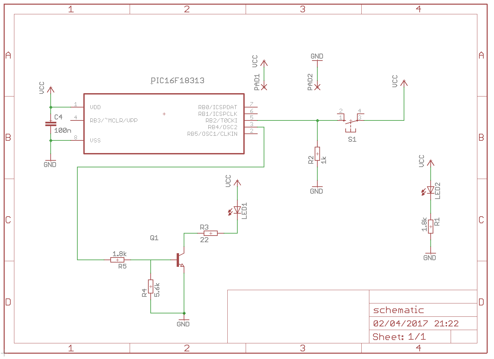

# PIC ML-L3

Simple remote control for Nikon DSLR cameras.

### Schematic

### Operation

The micro is always sleeping. INT pin is connected to a momentary switch (push button) which triggers the interrupt service routine. The code executed in the ISR drives a BJT and the right pulses are sent to the IR LED.

### Measurements at 4.8V (3xAAA batteries)

- Total idle (sleep) current draw:
  - With power LED indicator: ~0.3mA
  - Without power LED indicator (MCU alone): 40uA
- Peak current through IR led: ~70mA
